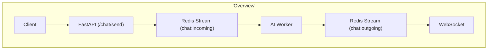
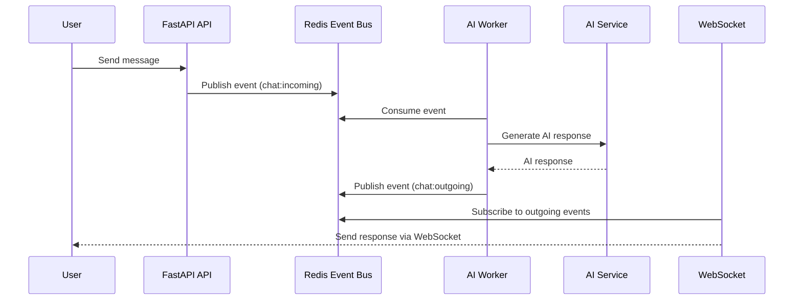

# AI Assistant

This project is a simplle AI assistant that uses Redis Streams in order to implement a pub/sub messaging system
For answer the chat uses Ollama with OpenAI model (gpt-oss)
Expose a websocket to consume the messages of the AI Agent

## Tech Stack
- FastAPI
- Redis
- Python
- Docker
- Ollama


## How to run
1. docker compose up -d
2. ollama run gpt-oss
2. uvicorn app.main:app --reload
3. wscat -c ws://localhost:8000/ws/123 


## Architecture Overview



## Flow Diagram




## Repo Structure
```mermaid
flowchart TB
    Root["ai-assistant/"]

    Root --> App["app/"]
    Root --> Tests["tests/"]
    Root --> Req["requirements.txt"]
    Root --> Env[".env"]
    Root --> Gitignore[".gitignore"]
    Root --> Readme["README.md"]

    subgraph App["app/"]
        Main["main.py\n(FastAPI entrypoint)"]
        Config["config.py\n(env vars & settings)"]

        App --> API["api/"]
        App --> Core["core/"]
        App --> Models["models/"]
        App --> Services["services/"]
        App --> Utils["utils/"]
        App --> Main
        App --> Config

        subgraph API["api/"]
            ChatAPI["chat.py\n(send / receive endpoints)"]
        end

        subgraph Core["core/"]
            EventBus["event_bus.py\n(pub / sub abstraction)"]
            Worker["ai_worker.py\n(AI listener)"]
        end

        subgraph Models["models/"]
            ChatModel["chat.py\n(Pydantic models)"]
        end

        subgraph Services["services/"]
            AIService["ai_service.py\n(AI logic)"]
        end

        subgraph Utils["utils/"]
            Logger["logger.py"]
        end
    end

    subgraph Tests["tests/"]
        TestChat["test_chat.py"]
    end
```