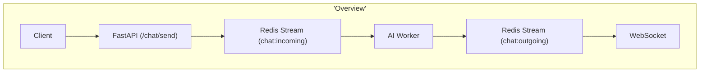

# AI Assistant

This project is a simplle AI assistant that uses Redis Streams in order to implement a pub/sub messaging system
For answer the chat uses Ollama with OpenAI model (gpt-oss)
Expose a websocket to consume the messages of the AI Agent

## Tech Stack
- FastAPI
- Redis
- Python
- Docker
- Ollama


## How to run
1. docker compose up -d
2. ollama run gpt-oss
2. uvicorn app.main:app --reload
3. wscat -c ws://localhost:8000/ws/123 


## Architecture Overview



## Flow Diagram

```mermaid
sequenceDiagram
    participant U as User
    participant API as FastAPI API
    participant R as Redis Event Bus
    participant W as AI Worker
    participant AI as AI Service
    participant WS as WebSocket

    U->>API: Send message
    API->>R: Publish event (chat:incoming)
    W->>R: Consume event
    W->>AI: Generate AI response
    AI-->>W: AI response
    W->>R: Publish event (chat:outgoing)
    WS->>R: Subscribe to outgoing events
    WS-->>U: Send response via WebSocket
```mermaid


## Repo Structure
ai-assistant/
├── app/
│   ├── main.py                # FastAPI entrypoint
│   ├── config.py              # env vars & settings
│   │
│   ├── api/
│   │   ├── __init__.py
│   │   └── chat.py            # send / receive endpoints
│   │
│   ├── core/
│   │   ├── __init__.py
│   │   ├── event_bus.py       # publish / subscribe abstraction
│   │   └── ai_worker.py       # mocked or real AI listener
│   │
│   ├── models/
│   │   ├── __init__.py
│   │   └── chat.py            # Pydantic models
│   │
│   ├── services/
│   │   ├── __init__.py
│   │   └── ai_service.py      # AI logic (mocked / OpenAI / Bedrock)
│   │
│   └── utils/
│       ├── __init__.py
│       └── logger.py
│
├── tests/
│   └── test_chat.py
│
├── requirements.txt
├── .env
├── .gitignore
└── README.md